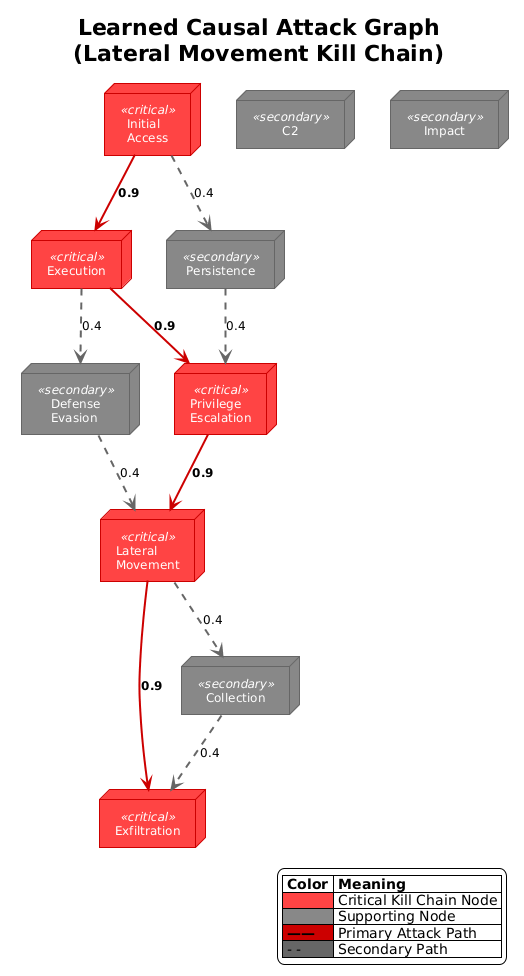

# ACIE: Adversarial Causal Intelligence Engine

## Research Preview v0.2.0

> A PyTorch implementation of Causal Discovery and Game Theoretic Robustness for Cyber-Defense. This engine learns attack paths from raw logs using differentiable DAG learning (NOTEARS) and defends against evasion using Robust Nash Equilibrium.

---

<p align="center">
  
</p>

<p align="center">
  <em>Figure 1: Causal Attack Graph learned from simulated DARPA OpTC logs. Nodes represent system entities; edges encode discovered causal dependencies.</em>
  <br/>
  <em><strong>Note:</strong> Figures represent demonstrative outputs for the Lateral Movement scenario.</em>
</p>

---

## **[WARNING]** EXPERIMENTAL RESEARCH CODE — NOT FOR PRODUCTION USE

This repository contains research-grade code intended for academic evaluation and experimentation. The implementation prioritizes clarity and reproducibility over runtime performance. Do not deploy in production environments without extensive validation.

---

## Abstract

Modern cyber-defense systems face two fundamental challenges: (1) discovering the causal structure of multi-stage attacks from high-dimensional log data, and (2) maintaining detection performance under adversarial evasion. **ACIE** addresses both challenges through a unified three-layer architecture:

| Layer | Theory | Function |
|-------|--------|----------|
| **Information Filter** | Shannon Entropy | Anomaly gating via entropy thresholding |
| **Causal Discovery** | NOTEARS (Zheng et al., 2018) | Differentiable DAG learning for attack path inference |
| **Robust Policy** | Game Theory | Nash equilibrium defense under worst-case perturbations |

<p align="center">
  
</p>

<p align="center">
  <em>Figure 2: Model accuracy under FGSM adversarial perturbations (ε = 0.1).</em>
  <br/>
  <em><strong>Note:</strong> Figures represent demonstrative outputs for the Lateral Movement scenario.</em>
</p>

---

## Installation

```bash
# Clone repository
git clone https://github.com/Youss2f/ACIE.git
cd ACIE

# Create virtual environment (recommended)
python -m venv .venv
.venv\Scripts\activate  # Windows
# source .venv/bin/activate  # Linux/macOS

# Install dependencies
pip install -r requirements.txt
```

### Requirements

- Python 3.8+
- PyTorch 1.12+
- NumPy, NetworkX, Matplotlib
- tqdm (progress bars)

---

## Quick Start

### 1. Configuration-Driven Training

```python
from acie import ACIE_Core, ACIETrainer, ACIEConfig, ACIERecorder
from acie.dataset import CyberLogDataset

# Initialize configuration (Governance Layer)
config = ACIEConfig(experiment_name="my_experiment")
config.training.epochs = 50
config.model.causal_nodes = 10

# Create dataset (implements BaseACIEDataset interface)
dataset = CyberLogDataset(
    num_samples=1000,
    input_dim=config.model.input_dim,
    num_classes=config.model.action_space
)

# Initialize model and trainer
model = ACIE_Core(
    input_dim=config.model.input_dim,
    causal_nodes=config.model.causal_nodes,
    action_space=config.model.action_space
)

recorder = ACIERecorder(experiment_name=config.experiment_name)
trainer = ACIETrainer(model=model, recorder=recorder)

# Train
trainer.fit(train_loader, val_loader, epochs=config.training.epochs)
```

### 2. Command-Line Training

```bash
python scripts/train.py \
    --dataset cyber \
    --epochs 100 \
    --batch-size 32 \
    --experiment-name darpa_experiment
```

### 3. Research Notebook

See [`notebooks/03_research_demo.ipynb`](notebooks/03_research_demo.ipynb) for a complete walkthrough demonstrating:
- Configuration initialization
- Dataset loading with interface verification
- Training with separated Recorder/Trainer architecture
- Adversarial robustness evaluation (FGSM attack)
- Causal graph visualization

---

## Architecture

ACIE follows a **Constitutional Architecture** enforcing strict separation of concerns:

```
acie/
├── interfaces.py    # Protocol definitions (Federalism)
├── config.py        # Centralized configuration (Governance)
├── recorder.py      # Logging & persistence (Judicial Branch)
├── trainer.py       # Training execution (Executive Branch)
├── core.py          # Model implementation (Legislative Branch)
├── dataset.py       # Standard datasets
└── darpa.py         # Streaming DARPA loader
```

### Interface Compliance

All datasets implement `BaseACIEDataset` or `BaseACIEIterableDataset`:

```python
from acie.interfaces import BaseACIEDataset

class CustomDataset(Dataset, BaseACIEDataset):
    @property
    def input_dim(self) -> int:
        return self._input_dim
    
    def __len__(self) -> int:
        return self.num_samples
    
    def __getitem__(self, idx) -> Tuple[Tensor, Tensor]:
        return self.features[idx], self.labels[idx]
```

---

## Theoretical Foundation

### Causal Discovery (NOTEARS)

The adjacency matrix $A$ is learned via continuous optimization with acyclicity constraint:

$$\min_A \mathcal{L}(A) + \lambda \|A\|_1 \quad \text{s.t.} \quad h(A) = \text{tr}(e^{A \circ A}) - d = 0$$

where $h(A) = 0$ enforces DAG structure (Zheng et al., 2018).

### Robust Nash Policy

The defense policy $\pi$ is optimized under worst-case adversarial perturbations:

$$\pi^* = \arg\max_\pi \min_{\|\delta\| \leq \epsilon} U(\pi, x + \delta)$$

This minimax formulation ensures robustness against FGSM-style evasion attacks.

---

## Forensic Audit Services

**Limited Availability: Research Collaboration Opportunities**

The author is accepting a limited number of research partnerships to validate this engine on production-grade telemetry data.

**Suitable Candidates:**
- Organizations with anonymized enterprise logs (SIEM exports, EDR telemetry)
- Security teams with labeled attack scenarios or red team exercise data
- Research institutions interested in causal attack graph analysis

**Engagement Deliverables:**
1. Causal Attack Graph visualization and analysis
2. Attack path probability assessment
3. Adversarial robustness evaluation report

**Contact:**
- Email: 1ouss9f@gmail.com
- LinkedIn: https://linkedin.com/in/youss9f

---

## Citation

If you use ACIE in your research, please cite:

```bibtex
@article{atertour2025causal,
  title={Causal AI for Cyber Defense: Learning Attack Paths via Differentiable DAG Discovery},
  author={Atertour, Youssef},
  journal={arXiv preprint arXiv:2512.XXXXX},
  year={2025},
  note={Under review}
}
```

### Related Work

- Zheng, X., et al. (2018). "DAGs with NO TEARS: Continuous Optimization for Structure Learning." NeurIPS.
- Goodfellow, I., et al. (2014). "Explaining and Harnessing Adversarial Examples." ICLR.
- DARPA Transparent Computing Program. OpTC Dataset.

---

## License

This project is released under the MIT License. See [LICENSE](LICENSE) for details.

---

## Acknowledgments

- DARPA Transparent Computing Program for the OpTC schema specification
- PyTorch team for the deep learning framework
- NetworkX developers for graph algorithms

---

<p align="center">
  <strong>ACIE</strong> — Where Information Theory meets Causal Inference meets Game Theory
</p>
